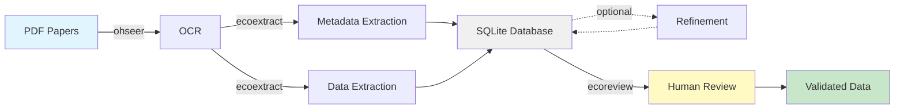

```{r, include = FALSE}
knitr::opts_chunk$set(
  collapse = TRUE,
  comment = "#>",
  eval = FALSE
)
```

EcoReview is a Shiny application for human-in-the-loop review of structured data extracted by [ecoextract](https://github.com/n8layman/ecoextract). This guide walks through installation, launching the app, and the end-to-end review workflow.

# The Three-Package Pipeline

EcoReview is the final step in a three-package ecosystem:



| Package | Purpose |
|---------|---------|
| [ohseer](https://github.com/n8layman/ohseer) | OCR -- converts PDFs to markdown |
| [ecoextract](https://github.com/n8layman/ecoextract) | AI-powered structured data extraction |
| **ecoreview** | Human review and validation (this package) |

# Installation

```{r install}
# renv (recommended for reproducible projects)
renv::install("n8layman/ecoreview")

# pak
pak::pak("n8layman/ecoreview")

# remotes
remotes::install_github("n8layman/ecoreview")

# devtools
devtools::install_github("n8layman/ecoreview")
```

# Launching the App

## Basic launch

```{r launch-basic}
library(ecoreview)
run_app()
```

This opens the app in your browser with a connect modal where you can browse to a `.db` file.

## Pre-connecting to a database

Pass `db_path` to skip the connect modal and open the database immediately:

```{r launch-db}
run_app(db_path = "ecoextract_records.db")
```

## Custom configuration

```{r launch-custom}
run_app(
  title      = "ChiroScan: Bat Interaction Review",
  app_name   = "ChiroScan",
  github_url = "https://github.com/n8layman/bat-interactions",
  export_prefix = "bat_interactions",
  db_path    = "records.db",
  priority_cols = c("Pathogen_Name", "Host_Name", "Detection_Result_Direction"),
  visible_cols  = c("Pathogen_Name", "Host_Name", "Detection_Result_Direction",
                    "Host_Species", "Pathogen_Species")
)
```

### `run_app()` parameters

| Parameter | Default | Description |
|-----------|---------|-------------|
| `title` | `"EcoReview: Data Validation"` | Browser tab and header title |
| `app_name` | `"EcoReview"` | Short name used in export filenames |
| `github_url` | ecoreview repo | Source link in header (set `NULL` to hide) |
| `export_prefix` | `"ecoextract"` | Prefix for exported CSV filenames |
| `db_path` | `NULL` | Path to `.db` file; skips connect modal if provided |
| `priority_cols` | `NULL` | Columns to pin left in the table |
| `visible_cols` | `NULL` | Columns to show on load (others hidden but editable) |
| `pdf_dir` | `NULL` | Override PDF directory for the viewer |

# Connecting to a Database

If you launch without `db_path`, the connect modal appears. You can:

- **Browse** to a `.db` file using the file picker
- **Type or paste** an absolute path directly
- **Paste a URL** to a remote database (the app downloads it automatically)

The app remembers your last connection per session. Use the **Change Database** button in the header to switch.

# The Review Interface

The app is divided into three panes:

```
┌─────────────────────────────────────────────────────────┐
│  Header: title | versions | Export buttons | Save DB    │
├──────────────────┬──────────────────────────────────────┤
│  Left sidebar    │  Main panel                          │
│                  │                                      │
│  Document        │  ┌─────────────────────────────────┐ │
│  selector        │  │  OCR / PDF viewer               │ │
│                  │  ├─────────────────────────────────┤ │
│  Show unreviewed │  │  Extracted records table        │ │
│  Show doc IDs    │  │                                 │ │
│                  │  │  [Add Row] [Delete] [Verify]    │ │
│  X of Y          │  └─────────────────────────────────┘ │
│  unreviewed      │                                      │
└──────────────────┴──────────────────────────────────────┘
```

## Document selector

- Dropdown lists all documents in the database, labelled with their filename
- `✓` prefix marks documents that have been verified
- **Show only unreviewed** checkbox filters to unverified documents
- **Show document IDs** checkbox switches labels from filenames to numeric `document_id` values, sorted numerically -- useful for navigating to a known ID

## Records table

Each row is one extracted record. Columns are defined by your ecoextract schema. The table supports:

- **Inline editing** -- double-click any cell to edit it
- **Per-column search** -- filter boxes above each column header
- **Multi-row selection** -- click, Shift+click, Ctrl/Cmd+click
- **Column management** -- click **Columns** to reorder or show/hide columns via drag-and-drop

## OCR viewer

The left side of the split view shows the OCR text for the current document. When you click a record row, supporting sentences are highlighted in the OCR text. Hover a highlighted sentence for a tooltip listing all evidence sentences for that record.

Alternatively, click **PDF** to switch to the original PDF viewer (requires the PDF file to be accessible).

# Review Workflow

The typical per-document workflow:

1. **Select a document** from the dropdown
2. **Read the OCR text** on the left; review the extracted records on the right
3. **Edit incorrect fields** -- double-click cells to correct values
4. **Add missing records** -- click **Add Row**, fill in the new row
5. **Delete hallucinated records** -- select the row(s), click **Delete**
6. **Click Verify** -- marks the document as reviewed (`reviewed_at` timestamp set)

Verified documents show `✓` in the dropdown. The badge in the sidebar counts `X of Y unreviewed`.

# Exporting Data

## Export Records CSV

Downloads all non-deleted records joined with document metadata. Wide columns (OCR text, reasoning) are excluded for readability. Sorted by `document_id` then `record_id`.

## Export Documents CSV

Downloads a pipeline status summary for all documents:
`document_id`, `file_name`, `first_author_lastname`, `publication_year`, `title`, `ocr_status`, `metadata_status`, `extraction_status`, `refinement_status`.

## Save Database

Downloads the current `.db` file with all edits and the full audit trail intact.

# Parallel / Team Review

Split a large database across multiple reviewers, then merge when done:

```{r split-combine}
# Split into 4 parts -- part 1 gets the lowest document IDs (sequential default)
parts <- ecoreview::split_db("ecoextract_records.db", n = 4)
# → ecoextract_records_part_1.db ... ecoextract_records_part_4.db

# Random assignment instead
parts <- ecoreview::split_db("ecoextract_records.db", n = 4,
                              random = TRUE, seed = 42)

# Each reviewer opens their part
run_app(db_path = "ecoextract_records_part_2.db")

# Recombine when all reviewers are done
ecoreview::combine_db(
  "path/to/parts/",
  output_path = "ecoextract_records_reviewed.db"
)
```

`combine_db()` validates that all parts share the same schema before merging and warns on any overlapping document IDs.

# Next Steps

- [Reviewing Extraction Output](reviewing-extraction-output.html) -- editing, adding, deleting records in depth
- [Accuracy Metrics](accuracy.html) -- interpreting the accuracy modal
- `?run_app`, `?split_db`, `?combine_db` -- function reference
